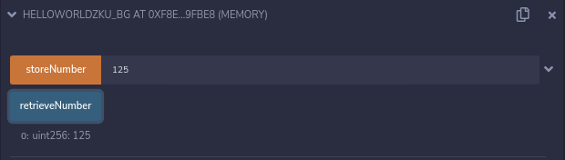

# Background Assignment 

this is the ZKU background assignment.

## Theory questions:
### What is a smart contract ?

Smart contract is the digital vending machine, it's a code that is stored in the related Blockchain and which is written in way that is translatable to a virtual machine, in solidity we are usually talking about the EVM ( Ethereum virtual machine ). This contracts are transparent and we are able to trust'em because they will behave exactly as the code say so, it's an algorithm promise.

### How are they deployed ?

We need to be connect with the network in which we are going to deploy it. We usually use Remix, or another tool that will deploy the contract, and we need to have a cryptocoin for it so we can pay for the contract to be deployed written in the chain. After a contract is deployed we can't change it. You got to compile the code before deploying too.
As deploy this tools (script, tool or plugin) are sending an Ethereum transaction containing the compiled code of the smart contract without specifying any recipient. You need access to a node , yours or a third party one.

### What is gas ?

It's a fuel fee that pays for the transaction computational effort , this is needed as an incentive otherwise people would not run nodes. We uses gas as a unit to measure the effort the computer requires to run it in the Ethereum network too.

### Why is gas optimization such a big focus when building smart contracts ?

The gas will depend on some variables as what is happening in the chain, the effort needed, how many nodes are available, priority, etc... 

So you actually will need to spend something if you want your application running. 

By optimizing the gas we can actually make our solutions and contracts cheaper and by doing so they're more viable.

### What is hash ?

hash is a function that will always convert one value to another one. It's used for many different applications highlighting checksum and cryptography. I have used it before for data indexing.

### Why do people use hashing to hide information ?

I believe that it's a good way to cryptography messages since a hash converts one value to another one, when using it to hide information every hash will always be unique and by having the keys to the hashing function/algorithm only the persons that are actually related to the message and have the keys will be able to Unencrypt Decrypt the message.

### How would you prove to a colorblind person that two different colored objects are actually of different colors? 

We could have the person who is colorblind show the items for a prover, and the prover to apoint which is which, then he can shuffle or not them. 

After the verifier shuffler or not them he can ask to apoint which is which to the prover.

In this case the prover not being colorblind will be able to tell the items apart due to their different color, the process can be repeat the ammount of times the colordblind Verifier wants to but because they're from different colors the other person will know.

By doing so it will be proved that they're different, because by hidden the objects and shuffling or not , if they're equal only the 

Usually in zku we do this by using math. Because math has enough tools to make a proof, and proof is what make we know that we or the person proofing is certain and correct about it. Since ZK is a proof without knowledge about the context we could use it convince someone about the different colors, since the person wouldn't see the whole context, just that the proof is correct, so we could show that two colors are different without even seeing the colors just because we see the proof is correct so we can believe it before even seeing the color.

## Pratical questions:

### Hello World
Write a storeNumber function to store an unsigned integer and then a retrieveNumber function to retrieve it. 

```sol
pragma solidity 0.5.4;
// Hello World with a uint instead of a string
contract HelloWorldZKU_BG {
    // private uint so we can only get the value with the function calling
    uint private unsigned_integer;

    // this will retrieve the number, by simply returning it.
    // we use public because it's a public function anyone can call
    // and we use view because it's a view , it's not cost anything to use this function.
    function retrieveNumber() public view returns (uint) {
        return unsigned_integer;
    }

    // this function will spend some gas, and write the new value to the blockchain.
    function storeNumber( uint new_value ) public {
        unsigned_integer = new_value;
    }
}
```

#### Hello world screenshot

Deployed


Values_entered in the contract, using the contract to test.



Transactions_log


### Ballot Changed
This is the [old ballot](https://docs.soliditylang.org/en/v0.8.11/solidity-by-example.html#voting)

#### When deploying

When deploying a ballot contract we have the following datastructure  = `bytes32[] memory proposalNames` ,  bytes 32 means the data should be like this following example, check this post on [stackoverflown](https://stackoverflow.com/questions/57836524/solidity-error-when-deploying-the-voting-tutorial-problem-with-constructor-and) for help:

```
    // an array of two 32-byte hexadecimal values
    // one byte can represent 2 hex digits,
    // I believe that we can actually have 64 different characters after 0x
    // an 8-bit byte can have values ranging from 00000000 to 11111111 in binary form, 
    // which can be conveniently represented as 00 to FF in hexadecimal.
    // max of 32 characters ASCII
    ["0x1212121212121212121212121212121212121212121212121212121212121212"] // 64 digits
    // the example bellow has two strings:
    // Arthur for president of  Brazil! , Other person is the president ok
    [
        "0x41727468757220666f7220707265736964656e74206f6620204272617a696c21",
        "0x4f7468657220706572736f6e2069732074686520707265736964656e74206f6b"
    ]
```

I used this site https://profitplane.com/str-to-bytes32, doesn't have 100% implementation but helps having "real" values

#### Proposed change for Ballot

To see the complete code, please check the folder at the repository it's here :
[https://github.com/afa7789/zku_assignments/tree/main/background/ballot_challenge.sol](https://github.com/afa7789/zku_assignments/tree/main/background/ballot_challenge.sol)

```sol
// SPDX-License-Identifier: GPL-3.0
pragma solidity >=0.7.0 <0.9.0;

/// @title Voting with delegation.
contract BallotChallenge {
    ... ( hidden code between)

    uint256 time_threshould_in_seconds = 300; //60 * 5 ,  5 minutes in seconds
    uint256 public start_timestamp = block.timestamp;

    address public chairperson;

    ... ( hidden code between)

    // modifier, it's a piece of code we can apply before a function.
    // A modifier will only allow it to work if the requirements are true
    // the modifier can be applied to more then one function
    modifier withinVotingPeriod {
        // A brief explanation on require bellow:
        //
        // if the statement in the first entry of require is true it doesn't fail
        // if it's false it will fail and display the message written at the second entry of the require function
        //
        // in this case we are checking it the time between now and start is lesser than the threshould set of five minutes.
        // timestamps in solidity are in a format that the smaller unit is a second it seems so.
        //
        // block.timestamp (uint): current block timestamp as seconds since unix epoch
        require(
            block.timestamp - start_timestamp < time_threshould_in_seconds,
            "Time to vote expired."
        );
        _;
    }

    ... ( hidden code between)

    /// Give your vote (including votes delegated to you)
    /// to proposal `proposals[proposal].name`.
    /// added the modifier to vote, so it will only happen when it's within the voting period.
    function vote(uint proposal) external withinVotingPeriod {
        ... ( hidden code between)
    }

    ... ( hidden code between)
    
}
```


#### Screenshoots

Deployed


Vote succesfully


Already voted reverted


Time expired, can't make the vote


